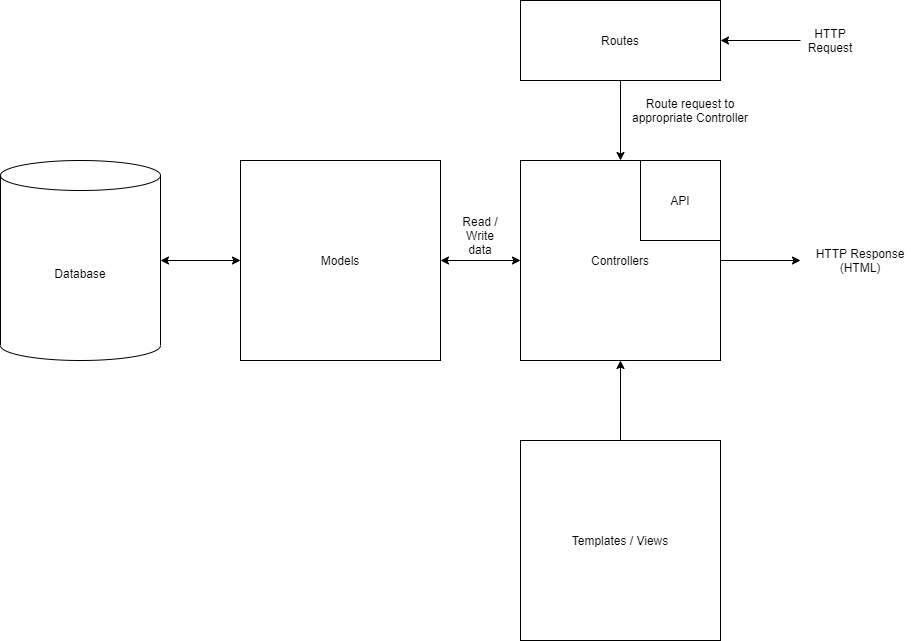

## Solent University

### School of Media Arts and Technology

### BSc (Hons) Digital and Technology Solutions

---
### Academic Year 2020 / 2021

### Grahame White

---
## Skilled - Talent Management On a Page

### Assignment 1

### Advanced Database Systems COM519

---
# Abstract
The assigned task was to develop, and deploy, a proof of concept webapp, with a
database back end that solves a work based problem.
The task was accomplished by
* Designing, and implementing, a database schema suitable for the selected
  project
* Developing a full stack webapp that carried out CRUD operations against the
  database
* Using good development practices in order to deliver a high quality solution

The webapp was designed, implemented and deployed successfully. Security issues
have been identified, although one remains unfixed at the project end. A number
of potential improvements have been identified should the webapp be developed
further.

---
## Deliverables
* [Hosted application](https://sleepy-chamber-76912.herokuapp.com/)
* [GitHub repository](https://github.com/Grahame-student/COM519_AE1_Skilled)
* [Tagged source code](TODO:)

---
# Introduction
## Problem Statement
Within Apollo, we currently use a spreadsheet to track the skills of the
Technical Department. This is tricky to maintain, prone to mistakes and team
progress is recorded by making period snapshots of the spreadsheet which are
then manually compared. This project proposes the development of a proof of
concept web app, to replace the spreadsheet and allow more advance
functionality to be added with less effort.

## Existing Solution
The current solution, a multi-sheet spreadsheet, allows the Functional Leads of
the Electronics, Software and Verification disciplines to:
* define roles (e.g. Junior Electronics Engineer, Senior Software Engineer, etc)
* define the skill requirements of the various roles
* arrange skills into a group

The main page of the spreadsheet has columns for each role and each employee
and a row for each skill. Including the team in India, this means that there
are roughly 40 columns and roughly 50 skills organised into 8 groups.

Each employee is assigned a role which is used to generate an appropriate
visualisation showing where effort should be spent to make the biggest
improvements to the team.

Maintaining all the formulae in the spreadsheet when new employees are added,
old ones removed or roles changed without breaking existing functionality is
starting to become more and more difficult.

## Developed Solution
The Skilled webapp was developed using the Express web application framework
with a mongoDB database backend. The served web pages used a combination of 
ejs templates, single page application techniques to minimise page reloads for
related tasks (e.g. managing skills), and a simple API to make accessing data
objects manageable. Bootstrap was used to help deliver a reasonably attractive,
and consistent style. 

# Aims and Objectives
## Aim
Develop a proof of concept web app with a database back end that could be
used to demonstrate a more manageable method of tracking team skills.

## Objectives
* Allow management of skills, including adding, deleting, modifying and
  grouping.
* Allow management of roles, including adding, deleting and modifying.
* Allow management of employees, including adding, deleting and modifying.
* Allow creation and visualisation of employee assessments to facilitate the
  identification of training needs.
* Develop a clean UI to make data entry simple.
* Develop a database schema that simplifies presenting the data.
* Develop the webapp using good development practices
* Deploy the webapp to a free hosting service

# System Overview
Express allows webapps to be developed using a model view controller (MVC)
pattern which separates out the concerns of representing domain objects,
implementing the business logic and presenting the results to the end user.

Figure 1: Architecture of an Express webapp

The developed webapp also implements a set of controllers that implement a REST
API to make it easier for the client side javascript to request that data be
operations needed to update the UI in place.

The Express webapp is hosted using Heroku's free serverless deployment option
, and the database is deployed using the MongoDB Atlas hosting option.

Development was carried out locally using environment variables appropriate for
the development system. Changes were checked into a git repository hosted on
GitHub, which was configured to automatically lint the code, carry out a
security evaluation using CodeQL and then deploy to Heroku if all the checks
passed. Additionally, the repository was configured to allow Dependabot to
periodically check dependencies and prepare pull requests should any be out of
date.

# Database Design
The database was designed to consist of 4 collections:
* Skill groups
* Job Roles
* Employees
* Users

## Skill Groups
The skill groups collection is intended to be a template set of skills groups
to be used when creating or modifying job roles. Unlike a relational database
they are not intended to help keep referential integrity, but they are intended
to provide consistency between roles. The option to not use the skills groups
to enforce referential integrity was taken as changes to the groups and skills
would have propagated to any related tables, which could mean that what an 
employee was assessed against previously could be mutated. This could be
addressed in a relational database but would add extra tables and complexity
which, for this project, would not have added value.

## Job Roles
Job roles consist of a title, and a list of 'snapshots' of the role's skill
requirements over time. Roles are intended to be a template for an employee
assessment and if the role's requirements change, which inevitably they do,
then those changes must not cause any prior employee assessment to change.
Each amendment to the skill requirements is stored as a snapshot of the
groups, skills and levels along with a timestamp to simplify requesting the
latest version, something that is important when creating an employee
assessment.

## Employees
Employees are comprised of a name, an email address, and a job title. They also
hold an assessment list that can be populated with employee assessment, which
are conceptually a copy of the latest skill requirements for the selected role.
They are subtly different in that each leaf skill also has an actual level
field that can be populated with the achieved skill level. Each assessment is
timestamped so that the latest assessment can be retrieved.

## Users
Users are the people that have been registered, and once logged in, are
authorised to make persistent changes. They consist of nothing more than an
email address, and a salted and hashed representation of their password.

# API Design
The REST API implemented follows many of the guidelines on Microsoft's website.
These guidelines were followed as they were cleared and more concise than those
found on the other sites investigated. The most salient points include:
* organise the endpoints around resources, in the case of the webapp this
  includes, amongst others:
  * charts
  * groups
  * skills
  * employees
  * roles
* use appropriate HTTP methods to represent CRUD operations, this way a single
  URI can have multiple functions.
  * POST - create
  * GET - request
  * PUT / PATCH - update
  * DELETE - delete
* related to the previous point is to not use verbs in the URI.
* version the API, this makes it easier to gradually transition to newer
  versions without breaking existing code.
  
# Security and Scalability
Good security is not easy to achieve and relying on manually spotting issues is
asking for trouble. To help mitigate this GitHub's Security helpers were
enabled to scan the code as it was pushed to the repository. Over the course of
development, 12 potential issues including
* project template containing hard coded credentials, resolved by making the
  session secret an environment variable
* clear text logging of sensitive information, resolved by removing the line
  doing the logging
* un-sanitised user input being used for various purposes, such as in a regex
  and in a query, resolved by installing a sanitization library and passing the
  identified values through it before using them.

# Conclusion and Reflection

